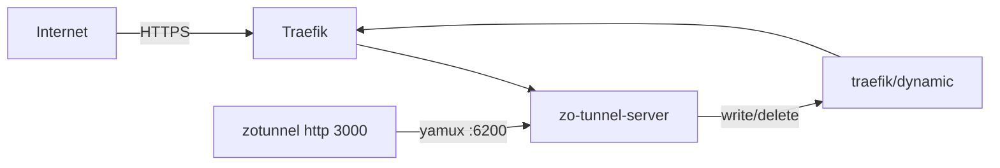

# Zo Tunnel

[](https://github.com/phamvanquyit/ZoTunnel/actions/workflows/ci.yml)
[](LICENSE)
[](https://hub.docker.com/r/phamvanquyit/zotunnel)

Expose local HTTP apps through your own VPS — subdomain routing, Traefik TLS, and a ngrok-style CLI.



## Quick Start

### 1. DNS (required before deploy)

You need **two A records** pointing to the same VPS IP. A wildcard alone is not enough.

| Type | Name / Host | Value | Covers |
|---|---|---|---|
| A | `*.tunnel.example.com` | `YOUR_VPS_IP` | `dashboard.…`, `my-api.…`, and every tunnel subdomain |
| A | `tunnel.example.com` | `YOUR_VPS_IP` | Apex root only (wildcard does **not** match this) |

Example at your DNS provider (Cloudflare, Namecheap, Vietnix, …):

```
Type  Host                    Value
A     *.tunnel                YOUR_VPS_IP
A     tunnel                  YOUR_VPS_IP
```

(Exact “Host” field depends on the panel — sometimes `*.tunnel` / `tunnel`, sometimes the FQDN.)

Why both?

- `*.tunnel.example.com` → `dashboard.tunnel.example.com`, `my-api.tunnel.example.com`, …
- `tunnel.example.com` → the bare domain itself (install / apex routes)
- DNS wildcards never include the parent name

Verify after propagation:

```bash
dig +short tunnel.example.com
dig +short dashboard.tunnel.example.com
dig +short anything.tunnel.example.com
# All three should return YOUR_VPS_IP
```

Minimum to run (if you skip apex for now): only the wildcard works for dashboard + tunnels. Client install then uses:

```bash
curl -sSL https://dashboard.tunnel.example.com/install | bash
```

With both records, apex install also works: `https://tunnel.example.com/install`.

### 2. Deploy server (Docker Hub)

Traefik must already run on the host (or as a container with `network_mode: host`) and watch a dynamic directory.

```bash
mkdir -p zo-tunnel && cd zo-tunnel
curl -fsSL -o docker-compose.yml \
  https://raw.githubusercontent.com/phamvanquyit/ZoTunnel/main/docker-compose.yml
curl -fsSL -o .env.example \
  https://raw.githubusercontent.com/phamvanquyit/ZoTunnel/main/.env.example
cp .env.example .env
# DOMAIN, AUTH_TOKEN, DASHBOARD_TOKEN
# TRAEFIK_DYNAMIC_DIR = host path Traefik watches (e.g. /home/docker/traefik/dynamic)
docker compose pull
docker compose up -d
```

Image: [`phamvanquyit/zotunnel`](https://hub.docker.com/r/phamvanquyit/zotunnel) (`:latest` / `:main`).

To build from source instead: clone the repo and run `docker compose up -d --build`.

zo-tunnel only writes YAML into that directory:

- `_zo-tunnel-base.yml` — shared upstream + dashboard/apex routers
- `zo-tunnel-{name}.yml` — per-client router (connect/disconnect)

Uses `network_mode: host` so Traefik reaches `http://127.0.0.1:6210`.

Client install:

```bash
curl -sSL https://dashboard.tunnel.example.com/install | bash
```

The Docker image ships a Linux client binary for the host arch. On macOS (or other platforms without a prebuilt binary), the install script downloads source from the server and builds `zotunnel` with Cargo (installs Rust automatically if needed).

Dashboard: `https://dashboard.tunnel.example.com`

### 3. Client

```bash
zotunnel config set --server tunnel.example.com:6200 --token <TOKEN>
zotunnel http 3000
# Forwarding  https://tunnel-xxxxxxxx.tunnel.example.com -> http://localhost:3000

zotunnel http 3000 --name my-api
# Forwarding  https://my-api.tunnel.example.com -> http://localhost:3000
```

## Traefik

When a client connects, the server writes `zo-tunnel-{name}.yml` into the Traefik dynamic directory. When it disconnects, the file is removed. Traefik watches the directory and provisions Let's Encrypt certificates per host.

On startup it writes `_zo-tunnel-base.yml` with:

- `dashboard.<domain>` (and separately `<domain>` apex) → `http://127.0.0.1:6210`

## Configuration

See [`configs/server.example.yaml`](configs/server.example.yaml). Docker uses env vars:

| Env | Role |
|---|---|
| `DOMAIN` / `ZO_DOMAIN` | Base domain |
| `AUTH_TOKEN` / `ZO_TOKEN` | Client auth token |
| `DASHBOARD_TOKEN` | Dashboard login |
| `TRAEFIK_DYNAMIC_DIR` | Host path to Traefik dynamic configs |
| `ZO_CLIENTS_DIR` | Client binaries for `/download` |

## CLI (`zotunnel`)

```bash
zotunnel config set --server HOST:6200 --token TOKEN
zotunnel config show
zotunnel http 3000 [--name NAME]          # foreground (Ctrl+C to stop)
zotunnel http 3000 --name my-app -d       # background, exits when connected
zotunnel status
zotunnel stop [NAME]                      # stop background tunnel(s)
zotunnel upgrade
zotunnel uninstall
```

## Development

```bash
cargo build --release
cargo test --workspace
cargo run -p zo-tunnel-server -- start --domain localhost --force
cargo run -p zo-tunnel-client -- http 3000 --name my-app
```

## Contributing

See [CONTRIBUTING.md](CONTRIBUTING.md). Please read the [Code of Conduct](CODE_OF_CONDUCT.md) and [Security Policy](SECURITY.md) before opening issues or PRs.

## Changelog

See [CHANGELOG.md](CHANGELOG.md).

## License

MIT — see [LICENSE](LICENSE).
